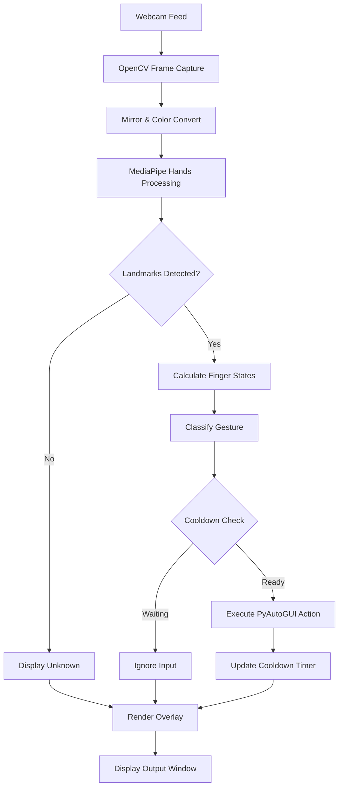

# Local Hand Gesture Desktop Controller

## Project Overview
Build a local, offline computer vision system that maps real-time hand gestures to desktop media and system controls. This project shifts focus from passive object detection to active human-computer interaction, providing immediate physical feedback.

## Environment Setup
1. Create a new isolated Python environment.
2. Install the required dependencies:
   - opencv-python
   - mediapipe
   - pyautogui
   - pycaw (optional, for advanced Windows volume control)

## System Architecture



## Implementation Timebox

### Phase 1: Environment and Base Tracking (0 - 20 Minutes)
- Initialize the virtual environment and install packages.
- Set up the OpenCV webcam loop.
- Integrate MediaPipe Hands to draw the skeletal overlay on the video feed.
- Verify the camera is mirroring correctly for natural interaction.

### Phase 2: Gesture Logic and Math (20 - 50 Minutes)
- Extract the 21 landmark coordinates from the MediaPipe output.
- Write helper functions to determine if specific fingers are extended.
- Compare the Y-coordinates of fingertip landmarks against their respective PIP (proximal interphalangeal) joint landmarks.
- Define state machines for at least three distinct gestures: Open Palm, Fist, and Thumbs Up.

### Phase 3: System Integration and Cooldowns (50 - 75 Minutes)
- Import PyAutoGUI to bridge the Python script with the OS.
- Map the classified gestures to system keys (e.g., Open Palm to Play/Pause, Fist to Mute).
- Implement a time-based cooldown mechanism to prevent a single gesture from triggering dozens of actions per second.
- Add visual text overlays to the OpenCV window to display the currently recognized gesture and cooldown status.

### Phase 4: Tuning and Edge Cases (75 - 90 Minutes)
- Adjust the MediaPipe minimum detection confidence threshold if tracking is jittery.
- Test the system under different lighting conditions.
- Refine the gesture boundaries to prevent accidental triggers.
- Finalize the script and document the specific hand shapes required for each action.

## Minimal Prototype File Structure

```text
gesture-controller/
├── README.md
├── requirements.txt
└── src/
    └── main.py
```

## What Goes in Each File

### `README.md`
- Project overview
- Setup steps
- Gesture-to-action mapping
- How to run the prototype

### `requirements.txt`
- `opencv-python`
- `mediapipe`
- `pyautogui`

### `src/main.py`
- OpenCV webcam loop
- MediaPipe Hands initialization
- Landmark extraction and finger-state helpers
- Gesture classification for Open Palm, Fist, and Thumbs Up
- PyAutoGUI action mapping
- Cooldown handling
- On-screen status overlay

## Minimal Prototype Flow

1. Open the webcam.
2. Detect a hand and extract landmarks.
3. Classify the gesture using simple finger-state rules.
4. Trigger the mapped desktop action if cooldown allows.
5. Display the recognized gesture on screen.

## Recommended Build Order

1. Create `requirements.txt`.
2. Build `src/main.py` with webcam and hand tracking.
3. Add gesture rules and cooldown logic.
4. Test and tune the gesture boundaries.


